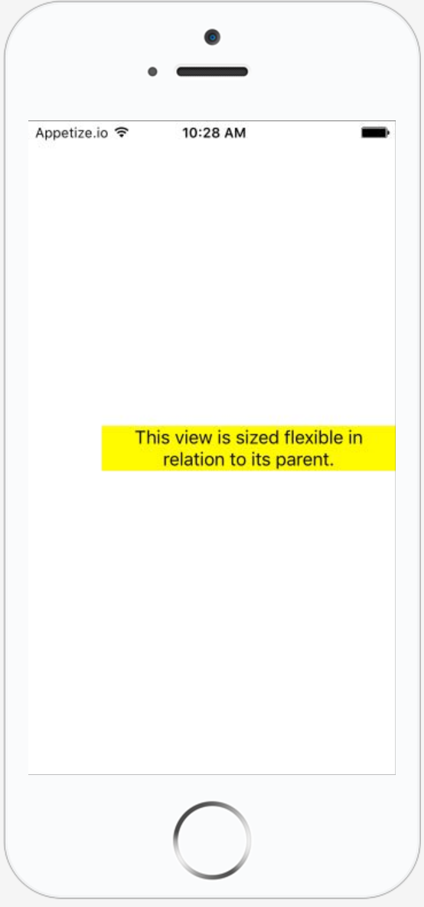
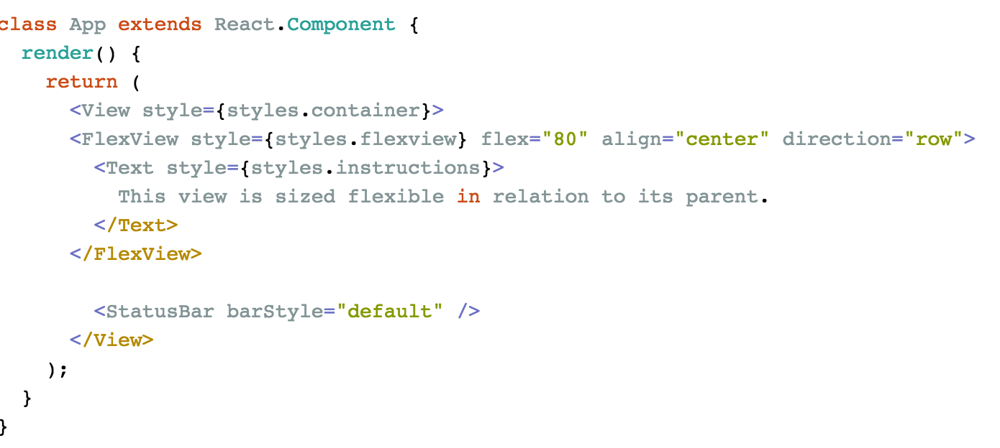

# react-native-flexview
A flexible view that can be scaled in relation to its parent

While I prefer to spend as little time styling as possible, I oftentimes end up having to mock up 
interfaces. The best flex implementation I've found is in one of my favorite web frameworks for angular 
[Angular Material](https://material.angularjs.org/latest/). One of it's greatest strengths is being able
to specify the flex of a view, so that it occupies a percentage of its parents width or height. 
This was one of the first things I missed when jumping into react-native. Hence I created the 
FlexView. Copy the code into your own codebase, or feel free to install it with npm.


## Usage

install it with:

``npm install react-native-flexview``

to use:

``import Flexview from "react-native-flexview"``


```javascript
import Flexview from "react-native-flexview"

class App extends React.Component {
  render() {
    return (
      <View style={styles.container}>
        <FlexView style={styles.flexview} flex="80" align="center" direction="row">
            <Text style={styles.instructions}>
            This view is sized flexible in relation to its parent.
            </Text>
        </FlexView>
      </View>
    );
  }
}
```

The component can be used with the following properties:

```typescript
direction: "column" | "row" // Defaults to row
flex: number //should either be between 0 and 1 or 0 and 100
align: "left" | "center" | "right" // Defaults to center
```

the style attribute is propagated to the wrapping view. 

## Contributions
If you find something is missing, feel free to contribute.

Below is a few screenshots of its usage:


### Centered with flex 80 - row
<div align="center">
        
</div>

### Example code for the above image
<div align="center">
        
</div>


### Left aligned with flex 80
<div align="center">
        
</div>


### Right aligned with flex 80
<div align="center">
        
</div>


### Code example with all properties
<div align="center">
        
</div>

